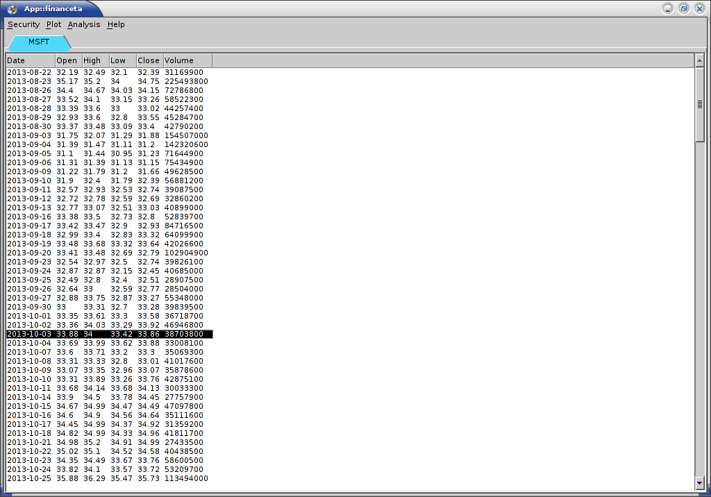
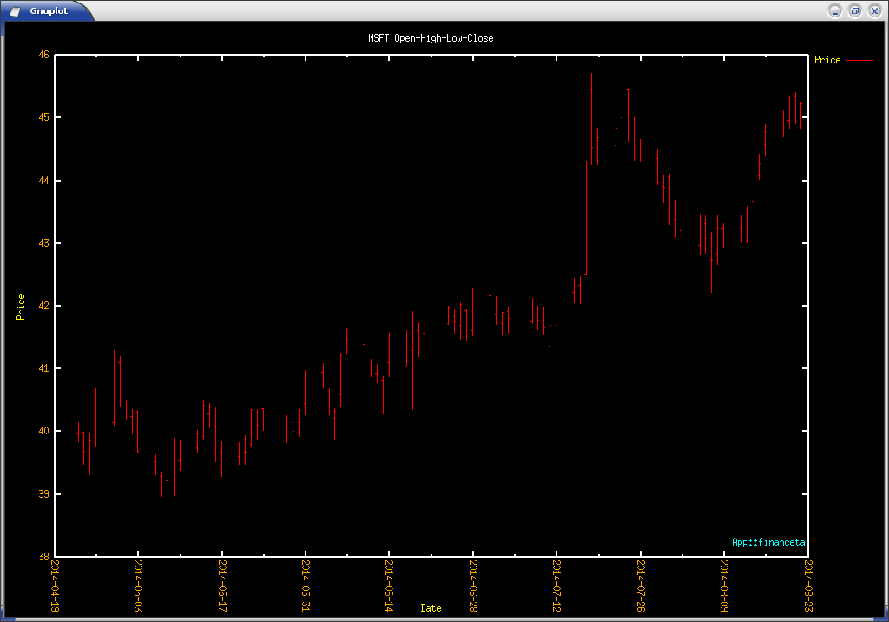
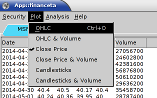
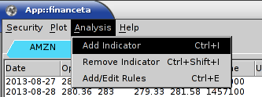
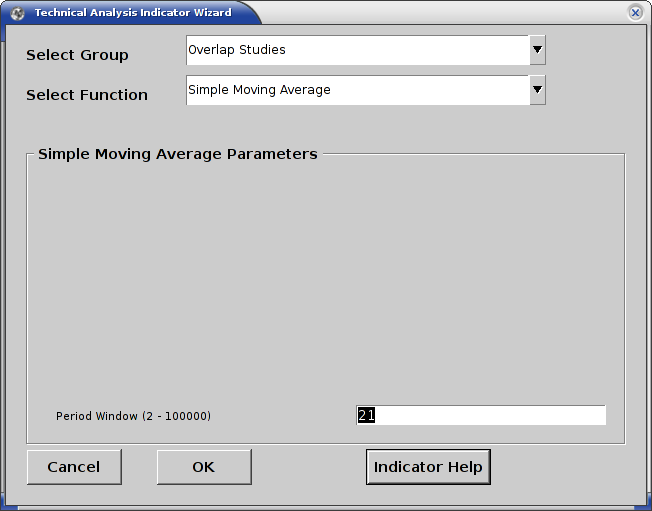
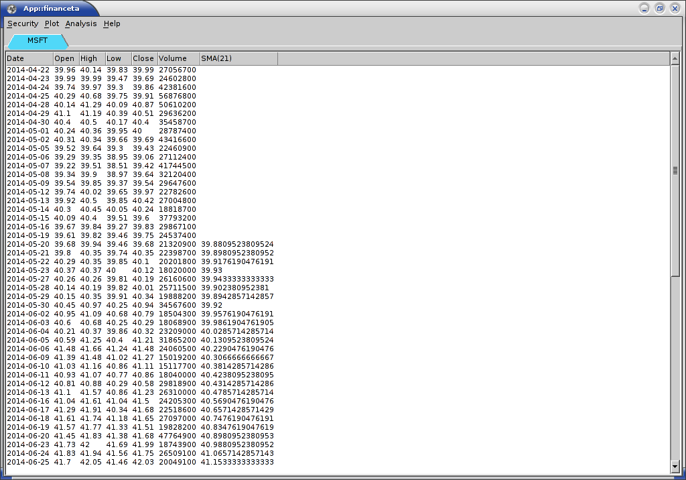
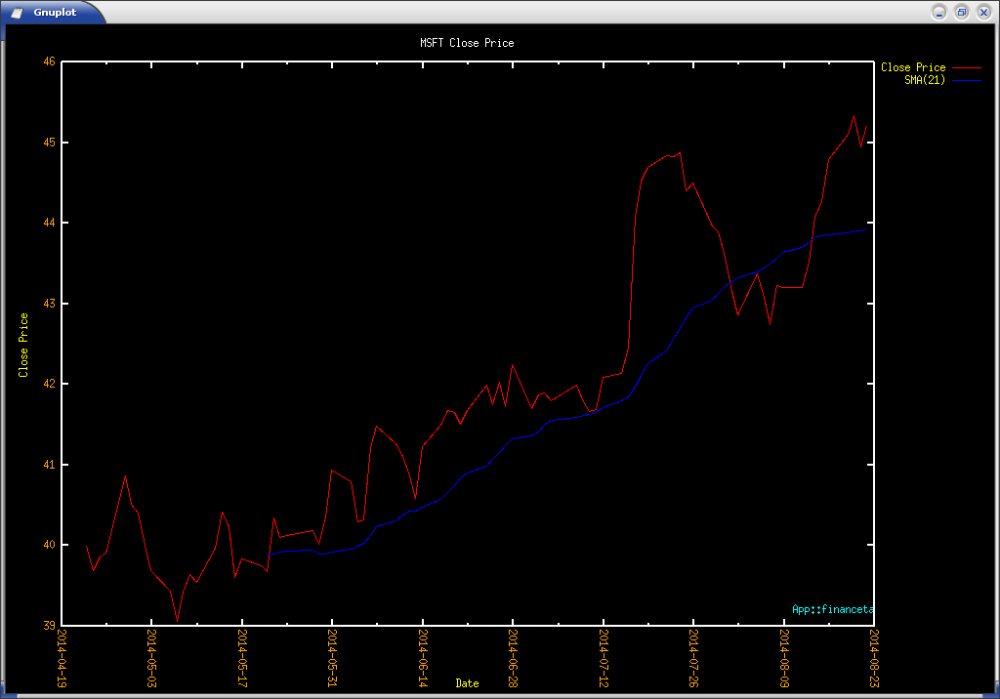

# Using _App::financeta_

## Starting the Application

We hope that you have successfully installed the application as outlined
[here](./install.html). If you have installed it from CPAN, you need to start
the application like this on Linux or BSD or Mac OS X or Cygwin:

    $ financeta

If you're using Strawberry Perl on Windows, you will need to run it like this:

    > financeta.bat

If you have installed the software from Github, you are running it in developer
mode and you should be running it like this:

    $ perl -Mblib ./bin/financeta

Please refer to the [install](./install.html) page for more details on
installing the application from Github and CPAN.

On Linux and other Unix variants, you need X-server running to view the GUI. On
Mac OS X, if you have installed Gnuplot, you will already have X-server
installed and the application should automatically start it up.

### Commandline options

The following commandline options are supported:

* `--debug`
  This turns on debugging on the console and can be used to send us any logs of
error messages or warnings if the application is not doing what you think it
should be doing.

## Selecting a Security

When we refer to the word _security_, we mean a company stock. However, as time
progresses and if data is freely available, we will be adding options and
futures to the mix as well. Hence _security_ is a term that groups all of these
under one.

Using the menu option _'Security'_ followed by _'New'_ as shown in the image below,
start the _'Security Wizard'_ dialog. Enter a **valid** stock symbol such as _'MSFT'_ in
the _'Enter Security Symbol'_ text box, select the start and end dates for which
you want data for (by default this is set to one year back from today) and hit
the _'OK'_ button.

If you do not know which symbol you need to enter you can hit
the _'Symbol Search'_ button and it will start your default web browser and
visit Yahoo! Finance for you to perform the search there. Since they already
provide an exhaustive database of symbols and information on symbols, their
service is complementary to _App::financeta_. We do not feel the need to
duplicate their efforts.

You will see a new tab opens with the name of the symbol you entered, which is
_'MSFT'_ in this case and all the stock data listed in tabular form. You will
also see a plot drawn in Gnuplot in a separate window that is started up and
controlled by the application.

The data downloaded is saved in `$TMPDIR` on Linux or BSD or Mac OSX and `$TEMP` or `$TMP` on Windows. If `$TMPDIR` is not
set, then `/tmp/` is used. The data is stored in a CSV file and if the same date
range is used by the user, the data is downloaded only once. If the user wants
to force the download of the data, they can select the _'Force download'_ option
in the _'Security Wizard'_.

The steps are outlined as follows:

- Select _'New'_ from the _'Security'_ menu option

- Enter a **valid** stock symbol and date range in the _'Security Wizard'_ such as _'MSFT'_

- View the retrieved data in a tab titled _'MSFT'_ or the symbol you have
  chosen

- View the open-high-low-close (OHLC) bar plot in Gnuplot that has been started
  by _App::financeta_

- More securities can be added in the same way by following the above steps.

Let us look at the various plot types that the application provides.

## Selecting a Plot

Various types of plots are provided to the user as part of this application.
Using the _'Plot'_ menu option, the user can select any type of plot and the
Gnuplot window will automatically display that plot type.

The current supported plot types are as follows:

- _OHLC_: This is the default plot type. It displays the Open-High-Low-Close data
  with the price being on the Y-axis and the date on the X-axis. This is a
standard finance plot used in the industry.

- _OHLC & Volume_: This plot type shows two plots in one window. The top plot is
  the OHLC plot as described above, and the bottom plot shows Volume in units of
1 million stocks on the Y-axis. There are some Volume based indicators where this kind of
plot can be very useful.

- _Close Price_: This plot type plots the Close price of the stock as a line
  graph with the Y-axis being the price and the X-axis being the date. This is
useful when you want to use indicators that prefer using a single price stream such as
Moving Average indicators.

- _Close Price & Volume_: This plot type is similar to the Close price plot type
  above and also has a sub-plot of Volume in units of 1 million stocks on the
Y-axis.

- _Candlesticks_: Some researchers like to use Candlestick charts to understand
  how stock trades move, and for them we have the candlestick plot feature.
There are about 61 candlestick indicators that _ta-lib_ supports and hence this
plot is essential to _App::financeta_.

- _Candlesticks & Volume_: This plot is useful if the user wants to do analysis
  with both Candlesticks and Volume indicators. The Volume is plotted in units
of 1 million stocks as a sub-plot.

Now it is time to select an indicator to add to the plot.

## Selecting an Indicator

To perform analysis on the security selected above, we need to try out some
indicators. Various types of indicators are available to the user and details
about each of them are provided in the chapter titled
[Indicators](./indicators.html). We have counted about 132 indicators that we
provide as part of _App::financeta_ that are available from _ta-lib_. However,
once we are satisfied with the documentation of all the indicators available, and
the application has all the expected features outlined in the
[Introduction](./intro.html), we will add our own custom indicators as well.

Let us try to do the simplest indicator - _Simple Moving Average_. This is a
form of _Overlap_ indicator, since it overlaps with the actual price data.

The steps to add this indicator are below:
- Load the data for the security _'MSFT'_ or your favorite stock as shown above.
  The OHLC or Close Price plots should be selected depending on your prefernce.

- Select _'Add Indicator'_ from the _'Analysis'_ menu to start the _'Technical
  Analysis Indicator Wizard'_.

- Select _'Overlap Studies'_ in the Group list, select '_Simple Moving Average_' in
  the Function list and set the period window parameter to 21 in the text box as
shown here and hit the _OK_ button.

- Once you do this, the simple moving average has been calculated and added to
  the data in the tab under the column _SMA(21)_  as shown.

- You can also see that the plot window has updated with the moving average line
  as shown.

Similarly one can add various indicators to the selected security tab.

Let us move on to understanding the indicators in the [next chapter](./indicators.html).

[Table of Contents](./index.html) [Next](./indicators.html)
