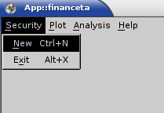
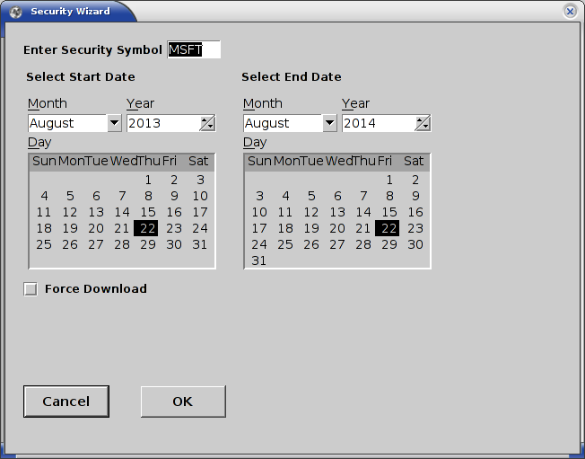

# Using _App::financeta_

## Starting the Application

We hope that you have successfully installed the application as outlined
[here](./install.html). If you have installed it from CPAN, you need to start
the application like this:

    $ financeta

If you have installed the software from Github, you are running it in developer
mode and you should be running it like this:

    $ perl -Mblib ./bin/financeta

Please refer to the [install](./install.html) page for more details on
installing the application from Github and CPAN.

On Linux and other Unix variants, you need X-server running to view the GUI. On
Mac OS X, if you have installed Gnuplot, you will already have X-server
installed and the application should automatically start it up.

## Selecting a Security

When we refer to the word _security_, we mean a company stock. However, as time
progresses and if data is freely available, we will be adding options and
futures to the mix as well. Hence _security_ is a term that groups all of these
under one.

Using the menu option _'Security'_ followed by _'New'_ as shown in the image below,
start the _'Security Wizard'_ dialog. Enter a **valid** stock symbol such as _'MSFT'_ in
the _'Enter Security Symbol'_ text box, select the start and end dates for which
you want data for (by default this is set to one year back from today) and hit
the _'OK'_ button.

You will see a new tab opens with the name of the symbol you entered, which is
_'MSFT'_ in this case and all the stock data listed in tabular form. You will
also see a plot drawn in Gnuplot in a separate window and started up as shown.

The steps are outlined as follows:

- Select _'New'_ from the _'Security'_ menu option

- Enter a **valid** stock symbol and date range in the _'Security Wizard'_ such as _'MSFT'_

- View the retrieved data in a tab titled _'MSFT'_ or the symbol you have
  chosen

- View the open-high-low-close (OHLC) bar plot in Gnuplot that has been started
  by _App::financeta_

[Back to Home](./index.html) [Next](./indicators.html)
